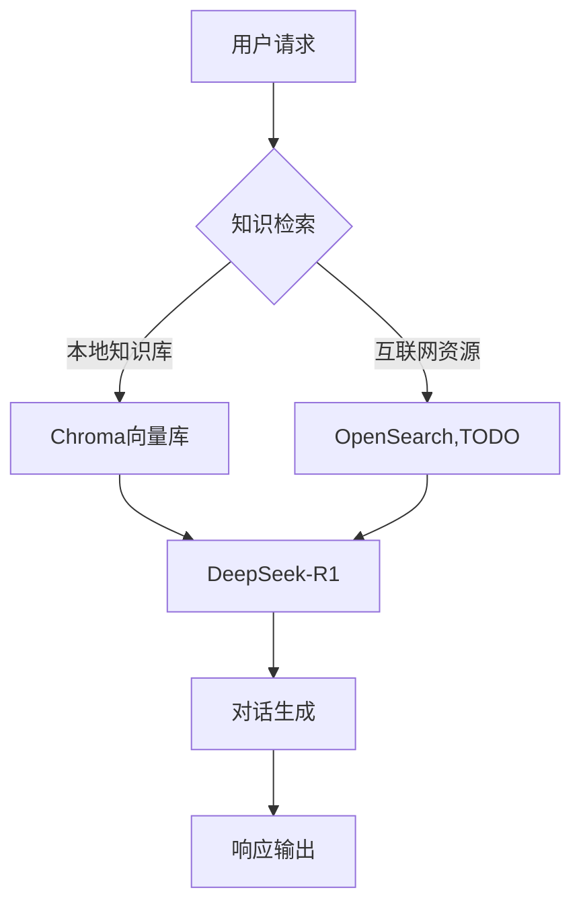

# 一个简单可用的RAG项目

## 核心特性

### 1. 网页版对话界面
- 支持基于**DeepSeek-R1推理模型**的智能对话
- 实时展示模型的**推理过程可视化**（思维链/决策树）

### 2. 多引擎支持
- 兼容主流AI引擎：
  - **Ollama**（本地部署优先）
  - **vLLM**（高性能计算支持）

### 3. 向量数据库
- 采用**Chroma本地向量库**实现高效语义检索
- 支持动态更新与增量学习

### 4. 嵌入方案
- 双重嵌入引擎支持：
  - **OllamaEmbeddings**（轻量级本地方案）
  - **HuggingFaceEmbeddings**（默认集成nomic模型）
- 支持自定义模型微调

### 5. 知识库管理
- 文件格式支持：
  ```text
  .docx | .pdf | .txt
  ```

## 流程图


本项目99%代码由Cursor生成
