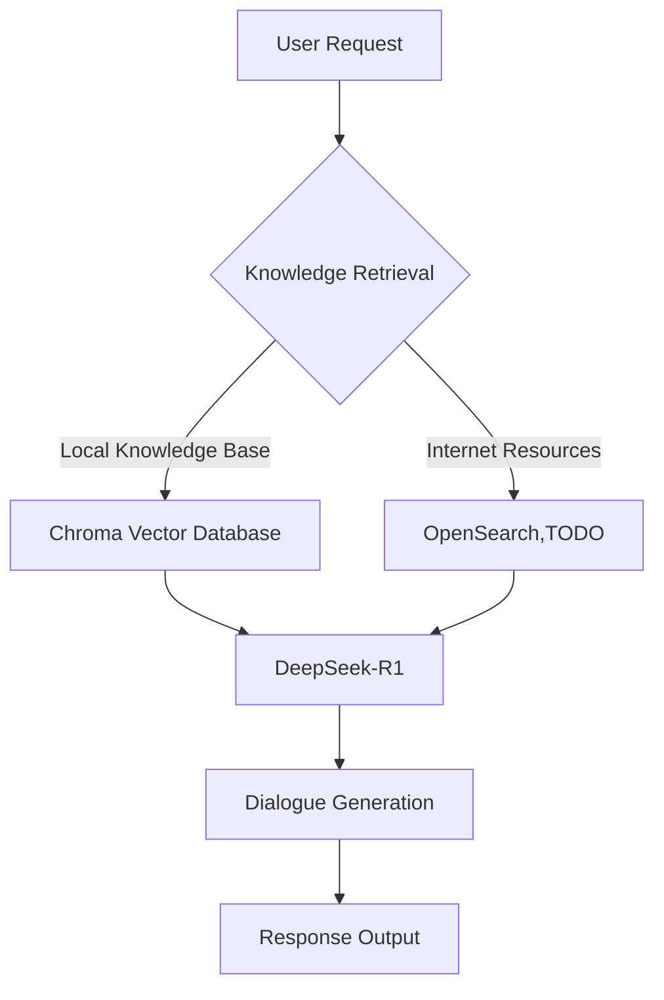

# A Simple and Usable RAG Project

## Core Features

### 1. Web-based Conversation Interface
- Supports intelligent dialogue based on **DeepSeek-R1 inference model**
- Real-time display of model's **reasoning process visualization** (chain of thought/decision tree)

### 2. Multi-Engine Support
- Compatible with mainstream AI engines:
  - **Ollama** (local deployment priority)
  - **vLLM** (high-performance computing support)

### 3. Vector Database
- Uses **Chroma local vector database** for efficient semantic retrieval
- Supports dynamic updates and incremental learning

### 4. Embedding Solutions
- Dual embedding engine support:
  - **OllamaEmbeddings** (lightweight local solution)
  - **HuggingFaceEmbeddings** (default integration with nomic model)
- Supports custom model fine-tuning

### 5. Knowledge Base Management
- Supported file formats:
  ```text
  .docx | .pdf | .txt
  ```

## Flow Chart



Required python version: 3.9

99% of this project's code was generated by Cursor
